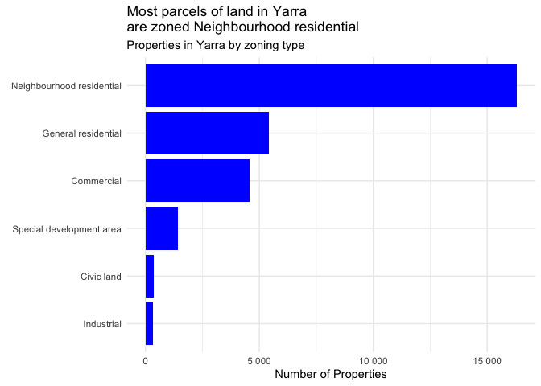

## R Markdown

Victoria has great websites
[Mapshare](https://mapshare.vic.gov.au/vicplan/) and [Digital
Twin](%5Bhttps://www.land.vic.gov.au/maps-and-spatial/digital-twin-victoria)
for looking at zoning and overlays for individual properties in
Melbourne. But doing policy analysis on these website can be
challenging. Useful information is dispersed across a multitude of files
and a complex set of joins is required to understand how planning laws
are applied in Victoria.

Melbourne Dwellings data solves this problem by creating a single
dataset with one row for each piece of land in Melbourne. For each row
there is information about how many dwellings are currently on the land,
it’s zoning, overlays, heritage (including heritage register data),
distance to public transport, and proximity to polluting roads.

## What you can do with this data

The data makes it easy to understand how properties are zoned. For
instance, if we want to see how land in City of Yarra is zoned we can
download the CSV file and make a summary in just a few lines of code:

<!-- -->

## Get the data

If you just want the data you can download it
[here](https://drive.google.com/drive/folders/1wxzX66pj2BIfTIbev0Z7bVJcj1SomiZk?usp=sharing).

Your first step should be to download these two files:

- “Melbourne dwelling data.csv” - A CSV file, containing one row for
  each piece of land in Melbourne
- “Melbourne Dwelling Data geometry_only.shp” A shape file that contains
  the geometries that link to the csv file through id variables lat and
  lon

The files can be analysed in any GIS software such as ARCGIS, FELT, QGIS
etc. If you aren’t interested in maps, you can analyse the CSV files in
R, Python or any other statistical package.

If you are unsure how to join together the CSV and shapefile, you can
instead use the file “Melbourne dwelling data.shp” which has every
variable. This is not recommended because the file is huge, and because
.shp requires columns to have short names that can be quite confusing.

## Get the data

There is a codebook available here which explains the meaning of every
variable.

# Recreate the data yourself

Start by reading the file R/01how_to_run_code.R

# Add more information about each property

The code is designed to be modular, so you don’t need to re-run
everything in order to add your own useful information about a property
such as it’s vicplan PFI or property price data. Simply add a folder in
the /R folder and edit the 02.compile.R file to add it in.
